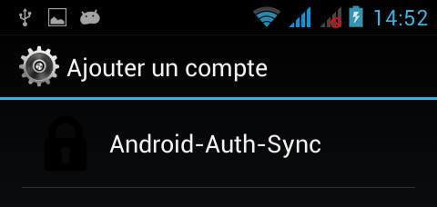

# Android Authenticator and Android Sync Adapter step by step

This is a sample application that helped me understand how to use Android Authenticator et Android Sync Adapter. 
Once your logged in, the app will sync a dummy list of contacts and display it.
 
- [Step 1](./STEP1.md) : Display a list of contacts
- [Step 2](./STEP2.md) : Set up Android Authenticator
- [Step 3](./STEP3.md) : Set up Sync Adapter

For an ease of use, there is not authentication check of any kind, you can basically use any login and password, it will always works.

The Sync Adapter fetches 3 new [random users](https://randomuser.me) every time. The more you let the app run, the more users there will be.

#### Sources
- [Write your own Android Authenticator](https://udinic.wordpress.com/2013/04/24/write-your-own-android-authenticator/)
- [Write your own Android Sync Adapter](https://udinic.wordpress.com/2013/07/24/write-your-own-android-sync-adapter/)